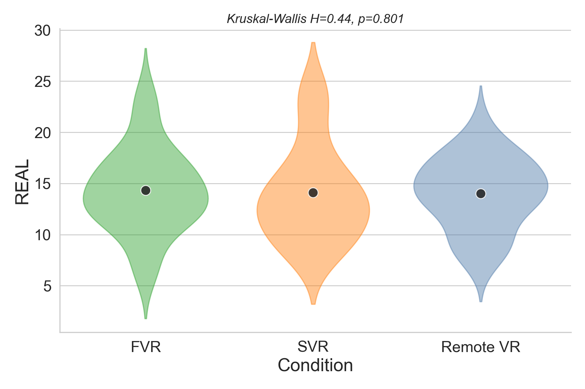

# rCode (Python Edition)

> Python port of [rCode](https://github.com/M-Colley/rCode) by [Mark Colley](https://m-colley.github.io/)

`rcode` is a Python package that streamlines statistical analysis and APA-compliant result reporting. It is a port of the original R package, built on top of `scipy`, `pingouin`, `statsmodels`, `matplotlib`, and `seaborn`.

## What Was Changed in This Python Port

Compared to Mark Colley's original `rCode` (R), this Python edition mainly introduces:

- A modular Python package layout (`rcode.setup`, `rcode.assumptions`, `rcode.reporting`, `rcode.visualization`, `rcode.data_processing`, `rcode.utils`) for reusable workflow-based analysis.
- Python-native statistical integration based on `scipy`, `pingouin`, `statsmodels`, and `scikit-posthocs` to reproduce and extend core inferential workflows.
- Automated APA-oriented reporting helpers that generate publication-ready LaTeX strings (e.g., NPAV, ART, Dunn, pairwise paper-style results with effect sizes).
- Expanded plotting utilities for within/between-subject comparisons and multi-factor effect visualization using matplotlib/seaborn objects (`Figure`, `Axes`) for downstream customization.
- Extra data-processing helpers (normalization, reshaping, value replacement, Pareto sorting, REI outlier detection) to support end-to-end analysis pipelines in Python.

## Requirements

- Python >= 3.10

### Core Dependencies

| Package | Version |
|---|---|
| numpy | >= 1.24 |
| pandas | >= 2.0 |
| scipy | >= 1.10 |
| matplotlib | >= 3.7 |
| seaborn | >= 0.12 |
| statsmodels | >= 0.14 |
| pingouin | >= 0.5 |
| scikit-posthocs | >= 0.8 |
| pyperclip | >= 1.8 |
| openpyxl | >= 3.1 |

## Installation

> It is strongly recommended to create a dedicated virtual environment to avoid dependency conflicts.

### Step 1: Create a virtual environment

```bash
python -m venv myenv
```

### Step 2: Activate the environment

**Windows:**

```bash
myenv\Scripts\activate
```

**macOS / Linux:**

```bash
source myenv/bin/activate
```

### Step 3: Install dependencies

```bash
pip install -r requirements.txt
pip install -e .
```

## Qwen Code Setup

This project can be used with [Qwen Code](https://github.com/QwenLM/qwen-code), an open-source AI coding agent for the terminal. Follow the steps below to set it up.

### Step 1: Install Qwen Code

**Linux / macOS:**

```bash
curl -fsSL https://qwen-code-assets.oss-cn-hangzhou.aliyuncs.com/installation/install-qwen.sh | bash
```

**Windows (Run as Administrator CMD):**

```cmd
curl -fsSL -o %TEMP%\install-qwen.bat https://qwen-code-assets.oss-cn-hangzhou.aliyuncs.com/installation/install-qwen.bat && %TEMP%\install-qwen.bat
```

Or install manually via npm (requires [Node.js](https://nodejs.org/en/download) v20+):

```bash
npm install -g @qwen-code/qwen-code@latest
```

### Step 2: Configure API Key

Add the API key in the qwen code, and select the MiniMax-M2.5 model.

```json
  "env": {
    "DASHSCOPE_API_KEY": "YOUR_API_KEY_HERE"
  },
  "model": {
    "name": "MiniMax-M2.5"
  }
```

### Step 3: Launch Qwen Code

```bash
cd path/to/your_project
qwen
```

Use `/stats` to verify the current session information and model configuration.

### Useful Commands

| Command | Description |
|---|---|
| `/help` | Display available commands |
| `/model <name>` | Switch model (e.g. `/model MiniMax-M2.5`) |
| `/stats` | Show current session information |
| `/clear` | Clear conversation history |
| `/compress` | Compress history to save tokens |

For more details, see the [Qwen Code documentation](https://qwenlm.github.io/qwen-code-docs/en/users/overview) and the [GitHub repository](https://github.com/QwenLM/qwen-code).

## Key Features

- **Automated Assumption Checking**: Verify normality (Shapiro-Wilk) and homogeneity of variance (Levene's test) for ANOVA models.
- **APA-Compliant LaTeX Reporting**: Generate copy-paste-ready LaTeX strings for NPAV, ART, Dunn tests, mean/SD, and more.
- **Enhanced Visualizations**: Box/violin plots with automatic parametric/non-parametric test selection and significance annotations.
- **Data Processing Utilities**: Normalize, replace values, Pareto front classification, REI-based outlier detection.

## Visualization Example

Below is an exploratory data analysis produced with `rcode.visualization`, demonstrating histogram, scatter plot with regression line, correlation matrix, and box plot outputs:


## Quick Start

```python
import pandas as pd
from rcode import setup, check_assumptions_for_anova, report_mean_and_sd

# Setup (sets matplotlib defaults, prints citation)
setup()

# Check ANOVA assumptions
df = pd.read_csv("data.csv")
result = check_assumptions_for_anova(df, y="score", factors=["group", "condition"])
print(result)

# Report mean and SD in LaTeX
report_mean_and_sd(df, iv="group", dv="score")
```

## Prompt Example: Generate Custom Violin Plots

Use the following prompts with an AI coding assistant when you want the generated analysis script to remain auditable across different models, agents, or API providers.

**Prompt 1** - Generate an analysis script with explicit method traceability:

> Based on the raw questionnaire file in my `text_dataset` directory, identify the questionnaire type, preprocess the data with the scoring rules defined in this project, export a cleaned scored CSV containing only the final analysis variables, then generate the requested plots by calling the functions from this project, and run the script in `myenv`.
>
> Strict requirements:
> 1. Reuse functions from this repository whenever a matching function already exists instead of silently re-implementing the analysis logic.
> 2. At the top of the generated script, add a short `Analysis Plan` comment block that states the detected questionnaire, the dependent variables, whether the design is within-subjects or between-subjects, and the statistical decision rule that will be used.
> 3. Structure the generated script as clearly separated analysis blocks with numbered section headers, following the style of a research script rather than a compact utility script. At minimum, use blocks for: loading libraries, reading data, cleaning / reshaping, descriptive statistics, assumption checks, main inferential analysis, post-hoc analysis or an explicit "not needed" block, summary of results, and plot generation.
> 4. Before each block, write a short multi-line comment that states:
>    - what this block does
>    - which repository function(s) are used in this block
>    - what statistical method is being run in this block
>    - why this method is appropriate for the current design
>    - what fallback rule applies if the repository does not provide the needed function
> 5. Inside the script, keep the comments local to the code they describe. Do not only describe the pipeline at the top of the file; the explanation must be repeated block by block where the code is executed.
> 6. If the repository does not contain a required function, implement the missing step explicitly in the script and label that block as a local fallback rather than a repository-backed step.
> 7. Print a short method summary to the console before generating plots, including the exact function names used for scoring, assumption checks, inferential testing, post-hoc testing, and reporting.
> 8. Do not use vague comments such as "run statistics here" or "analyze data". Every analysis block must name the actual method, for example: Shapiro-Wilk, repeated-measures ANOVA, ART, Wilcoxon signed-rank, paired t-test, Holm correction, or descriptive mean/SD reporting.
> 9. Keep the visualization customization separate from the statistical logic so that later style changes do not alter the analysis path.
>
> When refining plot aesthetics later, preserve the analysis comments and the printed method summary unless I explicitly ask to change the statistics.

**Prompt 2** - Customize colors and style without changing the analysis logic:

> Change the colors of the three groups to match the reference image (green, orange, purple), remove all scatter points from the violin plot, keep only the mean, and preserve the existing analysis method comments and printed method summary.

### Sample Output

The script generates both violin plots and paper-style LaTeX text for each dependent variable. Example output:

```latex
\textit{FVR} ($M = 23.23$, $SD = 4.01$) did not differ significantly from
\textit{Remote} ($M = 23.03$, $SD = 2.76$) in spatial presence (sp)
($t(29) = 0.30$, $p = .766$).

\textit{LocoScooter} ($M = 6.07$, $SD = 0.62$) was rated significantly higher
than \textit{Joystick} ($M = 3.36$, $SD = 1.69$) in physical demand
($W = 91$, $p = .001$, $r = 0.64$).
```

Example violin plot output:



The function `report_pairwise_paper_style()` automatically:
1. Checks normality of paired differences (Shapiro-Wilk)
2. Selects the appropriate test (paired *t*-test or Wilcoxon signed-rank)
3. Reports *M*, *SD*, test statistic, *p*-value
4. Includes effect size (Cohen's *d* or rank-biserial *r*) for significant results
