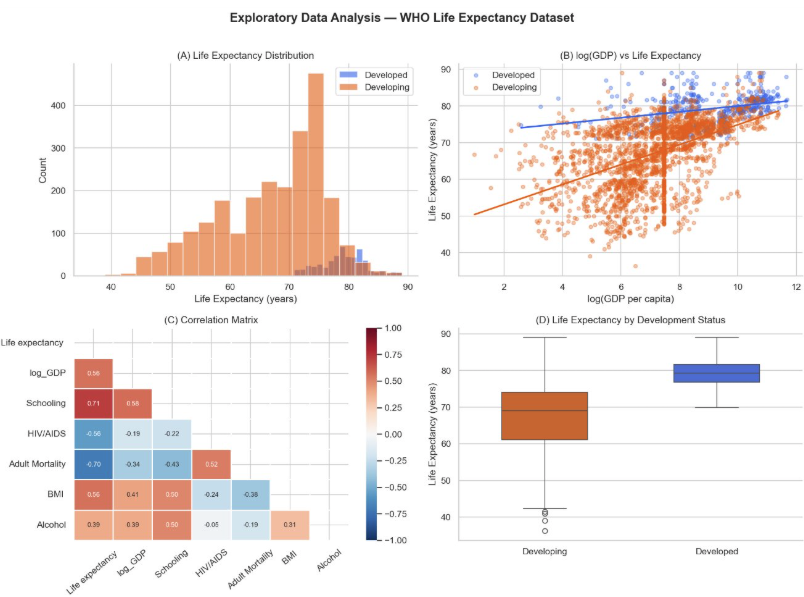

# rCode (Python Edition)

> Python port of [rCode](https://github.com/M-Colley/rCode) by [Mark Colley](https://m-colley.github.io/)

`rcode` is a Python package that streamlines statistical analysis and APA-compliant result reporting. It is a port of the original R package, built on top of `scipy`, `pingouin`, `statsmodels`, `matplotlib`, and `seaborn`.

## Requirements

- Python >= 3.10

### Core Dependencies

| Package | Version |
|---|---|
| numpy | >= 1.24 |
| pandas | >= 2.0 |
| scipy | >= 1.10 |
| matplotlib | >= 3.7 |
| seaborn | >= 0.12 |
| statsmodels | >= 0.14 |
| pingouin | >= 0.5 |
| scikit-posthocs | >= 0.8 |
| pyperclip | >= 1.8 |
| openpyxl | >= 3.1 |

## Installation

> **⚠️ It is strongly recommended to create a dedicated virtual environment** to avoid dependency conflicts.

### Step 1: Create a virtual environment

```bash
python -m venv myenv
```

### Step 2: Activate the environment

**Windows:**

```bash
myenv\Scripts\activate
```

**macOS / Linux:**

```bash
source myenv/bin/activate
```

### Step 3: Install dependencies

```bash
pip install -r requirements.txt
pip install -e .
```

## Claude Code Setup (via Alibaba Cloud Coding Plan)

This project can be used with [Claude Code](https://code.claude.com/docs/en/overview) powered by [Alibaba Cloud Coding Plan](https://help.aliyun.com/zh/model-studio/claude-code-coding-plan). Follow the steps below to configure your environment.

### Step 1: Install Claude Code

Make sure [Node.js](https://nodejs.org/en/download/) (v18.0+) is installed, then run:

```bash
npm install -g @anthropic-ai/claude-code
claude --version   # verify installation
```

### Step 2: Configure API access

**macOS / Linux:**

```bash
mkdir -p ~/.claude
nano ~/.claude/settings.json
```

**Windows (PowerShell):**

```powershell
New-Item -ItemType Directory -Force -Path "$env:USERPROFILE\.claude"
notepad "$env:USERPROFILE\.claude\settings.json"
```

Paste the following into `settings.json`:

```json
{
    "env": {
        "ANTHROPIC_AUTH_TOKEN": "sk-sp-92cfc7ad460242aeac574fa8e7163384",
        "ANTHROPIC_BASE_URL": "https://coding.dashscope.aliyuncs.com/apps/anthropic",
        "ANTHROPIC_MODEL": "MiniMax-M2.5"
    }
}
```

Then create or edit `~/.claude.json` (or `%USERPROFILE%\.claude.json` on Windows) and add:

```json
{
  "hasCompletedOnboarding": true
}
```

> This prevents the `Unable to connect to Anthropic services` error on first launch.

### Step 3: Launch Claude Code

```bash
cd path/to/your_project
claude
```

Use `/status` to verify the model, API key, and base URL are configured correctly.

### Step 4 (Optional): VS Code Plugin

1. Open VS Code → Extensions → search for **Claude Code for VS Code** and install.
2. Restart VS Code, click the Claude Code icon in the top-right corner.
3. Type `/` → select **General config** → set the model to `MiniMax-M2.5`.

### Useful Commands

| Command | Description |
|---|---|
| `/status` | Check current model, API key, and base URL |
| `/model <name>` | Switch model (e.g. `/model MiniMax-M2.5`) |
| `/init` | Generate `CLAUDE.md` for project-level instructions |
| `/clear` | Clear conversation history |
| `/plan` | Planning mode (analyze only, no code changes) |
| `/compact` | Compress conversation history to free context window |

For more details, see the [official Claude Code documentation](https://code.claude.com/docs/en/overview) and [Alibaba Cloud Coding Plan guide](https://help.aliyun.com/zh/model-studio/claude-code-coding-plan).

## Key Features

- **Automated Assumption Checking**: Verify normality (Shapiro-Wilk) and homogeneity of variance (Levene's test) for ANOVA models.
- **APA-Compliant LaTeX Reporting**: Generate copy-paste-ready LaTeX strings for NPAV, ART, Dunn tests, mean/SD, and more.
- **Enhanced Visualizations**: Box/violin plots with automatic parametric/non-parametric test selection and significance annotations.
- **Data Processing Utilities**: Normalize, replace values, Pareto front classification, REI-based outlier detection.

## Visualization Example

Below is an exploratory data analysis produced with `rcode.visualization`, demonstrating histogram, scatter plot with regression line, correlation matrix, and box plot outputs:



## Quick Start

```python
import pandas as pd
from rcode import setup, check_assumptions_for_anova, report_mean_and_sd

# Setup (sets matplotlib defaults, prints citation)
setup()

# Check ANOVA assumptions
df = pd.read_csv("data.csv")
result = check_assumptions_for_anova(df, y="score", factors=["group", "condition"])
print(result)

# Report mean and SD in LaTeX
report_mean_and_sd(df, iv="group", dv="score")
```


## Prompt Example: Generate Custom Violin Plots

The following prompts were used with an AI coding assistant to generate violin plots from the dataset in this project.

**Prompt 1** — Generate violin plot script:

> Based on the CSV file in my text_dataset directory, write a script to generate violin plots by calling the functions from this project, and run this script in "myenv" environment.

**Prompt 2** — Customize colors and style:

> Change the colors of the three groups to match the reference image (green, orange, purple), remove all scatter points from the violin plot, and keep only the mean.

### Sample Output

The script generates both violin plots and paper-style LaTeX text for each dependent variable. Example output:

```latex
\textit{FVR} ($M = 23.23$, $SD = 4.01$) did not differ significantly from
\textit{Remote} ($M = 23.03$, $SD = 2.76$) in spatial presence (sp)
($t(29) = 0.30$, $p = .766$).

\textit{LocoScooter} ($M = 6.07$, $SD = 0.62$) was rated significantly higher
than \textit{Joystick} ($M = 3.36$, $SD = 1.69$) in physical demand
($W = 91$, $p = .001$, $r = 0.64$).
```

The function `report_pairwise_paper_style()` automatically:
1. Checks normality of paired differences (Shapiro-Wilk)
2. Selects the appropriate test (paired *t*-test or Wilcoxon signed-rank)
3. Reports *M*, *SD*, test statistic, *p*-value
4. Includes effect size (Cohen's *d* or rank-biserial *r*) for significant results

## Citation

```bibtex
@misc{colley2024rcode,
  author       = {Mark Colley},
  title        = {rCode: Enhanced R Functions for Statistical Analysis and Reporting},
  year         = {2024},
  howpublished = {\url{https://github.com/M-Colley/rCode}},
  doi          = {10.5281/zenodo.16875755}
}
```

## Module Overview

| Module | Description |
|---|---|
| `rcode.setup` | Environment configuration, citation printing |
| `rcode.utils` | Utility functions (`normalize`, `na_zero`, `path_prep`, etc.) |
| `rcode.assumptions` | ANOVA assumption checking (normality, homogeneity) |
| `rcode.reporting` | APA-compliant LaTeX report generation |
| `rcode.visualization` | Statistical plots with automatic test selection |
| `rcode.data_processing` | Data reshaping, Pareto analysis, REI outlier detection |

## Available Visualizations

All plots are built on matplotlib/seaborn and return `Figure` and `Axes` objects for further customization and saving.

| Plot Type | Function | Description |
|---|---|---|
| Box/Violin Plot (within-subjects) | `gg_withinstats_with_normality_check()` | Box + violin plot with significance annotations; automatically selects parametric or non-parametric test based on Shapiro-Wilk normality check |
| Box/Violin Plot (between-subjects) | `gg_betweenstats_with_normality_check()` | Same as above, but for independent (between-subjects) comparisons |
| Effect Plot | `generate_effect_plot()` | Displays main or interaction effects with error bars and trend lines; suitable for multi-factor experiments |
| MOBO Plot | `generate_mobo_plot()` | Multi-objective Bayesian optimization plot showing sampling and optimization phases with per-group trend lines and polynomial fitting |

## Available Analyses & Reporting

| Category | Function | Description |
|---|---|---|
| Normality Test | `check_normality_by_group()` | Per-group Shapiro-Wilk normality test |
| ANOVA Assumption Check | `check_assumptions_for_anova()` | One-step check of normality (residuals + groups) and homogeneity of variance (Levene's test); automatically determines whether parametric or non-parametric ANOVA should be used |
| NPAV Report (F-based) | `report_npav()` | Generates APA-formatted LaTeX report with partial η²ₚ effect size and confidence intervals |
| NPAV Report (Chi²-based) | `report_npav_chi()` | Same as above but based on chi-square statistic, with Cohen's *w* effect size |
| ART ANOVA Report | `report_art()` | LaTeX report for Aligned Rank Transform ANOVA |
| nparLD Report | `report_npar_ld()` | Non-parametric longitudinal data analysis report |
| Mean & SD Report | `report_mean_and_sd()` | Outputs per-group *M* and *SD* in LaTeX format |
| Dunn Post-hoc Report | `report_dunn_test()` / `report_dunn_test_table()` | Significant pairwise group comparisons with rank-biserial effect size |
| ggstatsplot-style Report | `report_ggstatsplot()` / `report_ggstatsplot_posthoc()` | Auto-generates APA reports for Kruskal-Wallis, t-test, Wilcoxon, etc. |
| Effect Size Calculation | `r_from_wilcox()` / `r_from_npav()` | Computes Rosenthal *r* effect size from Wilcoxon/NPAV p-values |
| LaTeX Formatting | `latexify_report()` | Converts report text to LaTeX format (R², itemize, etc.) |
| Normalization | `normalize()` | Linear rescaling to an arbitrary range |
| Pareto Front Classification | `add_pareto_column()` | Multi-objective Pareto non-dominated sorting (with optional pygmo acceleration) |
| REI Outlier Detection | `remove_outliers_rei()` | Flags suspicious survey responses based on Response Entropy Index |
| Data Reshaping | `reshape_data()` | Converts wide-format Excel data to long format |
| Value Replacement | `replace_values()` | Batch value replacement across a DataFrame |
| Paper-style Pairwise Report | `report_pairwise_paper_style()` | Auto-selects paired t-test or Wilcoxon based on Shapiro-Wilk normality check; generates LaTeX text with *M*, *SD*, test statistic, *p*-value, and effect size (Cohen's *d* or rank-biserial *r*) in APA paper style |
